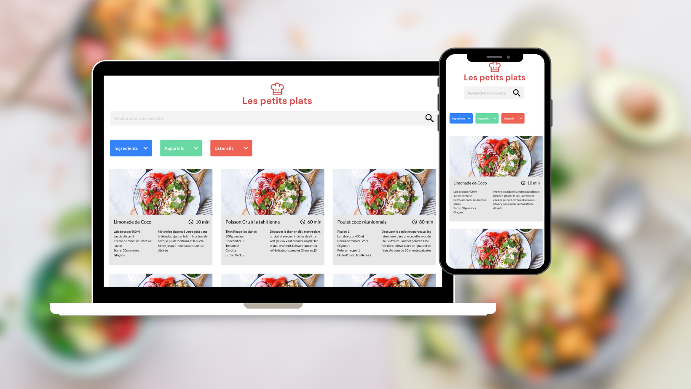

# Les Petits Plats Project

## Description
This project is a recipe website with an algorithm to search for recipes. The user can search for a recipe by entering a keyword in the search bar. The search will be done on the title, description and ingredients of the recipes. The user can also filter the recipes by selecting a category. 



You can reach the website [here](https://jucroizer.github.io/JustineCroizer_7_15062022-/).

## Installation
Clone this repository.
```bash
git clone
```
## Usage
Open the index.html file in your browser or use the Live Server extension in Visual Studio Code.

## Technologies
* HTML5
* CSS3
* JavaScript

Visula Studio Code was used as code editor and the project was versioned with Git and GitHub. Extension Live Server was used to run the project locally.

## Project Status
Project is: _ended_.
